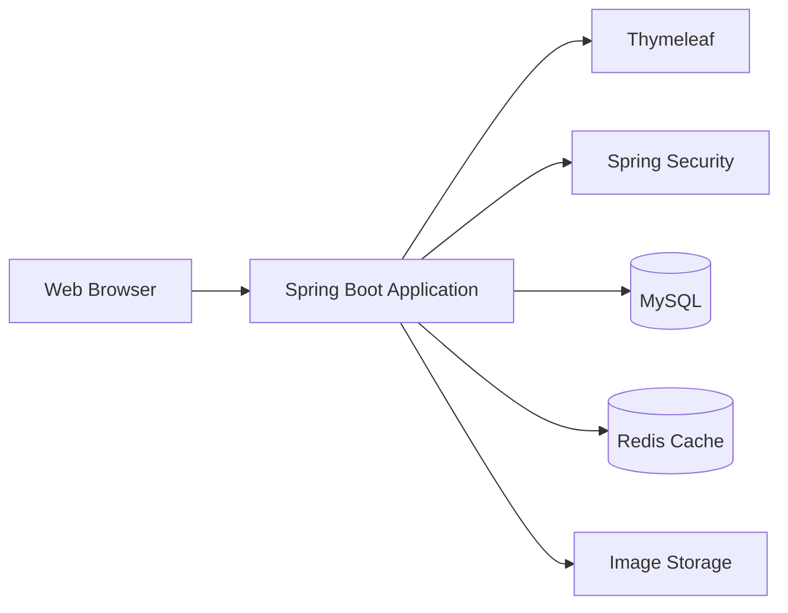

# Awesome Shopping Mall

Spring Boot와 Thymeleaf로 구현한 서버 사이드 렌더링 방식의 의류 쇼핑몰 프로젝트입니다.

상품 조회와 검색, 회원 인증, 주문, 리뷰, 관리자 기능을 제공하며 Redis 캐싱과 동시성 제어를 적용해 조회 성능과 주문 데이터의 일관성을 개선했습니다.

## 주요 기능

- Spring Security 기반 회원가입, 로그인, 로그아웃 및 세션 인증
- 카테고리별 상품 목록 조회와 페이지네이션
- 상품명 기반 검색 및 상품 상세 조회
- 주문 수와 등록일을 기준으로 한 Best/New 상품 조회
- Redis를 활용한 Best/New 상품 조회 결과 캐싱
- 상품 이미지 업로드 및 외부 디렉터리 리소스 제공
- 주문 생성과 사용자별 주문 내역 조회
- 비관적 락을 이용한 상품 주문 수 동시성 제어
- 구매 이력을 확인한 후 리뷰 작성 및 삭제
- 관리자용 미처리·처리 완료 주문 조회와 주문 상태 변경
- 스레드 풀과 `CompletableFuture`를 이용한 비동기 이벤트 처리

## 시스템 구성



## 핵심 기능 흐름

### Best/New 상품 조회

```text
사용자 → MainController: 메인 페이지 요청
MainController → ProductService: Best/New 상품 조회
ProductService → Redis: 캐시 조회

캐시 HIT → Redis에 저장된 상품 목록 반환
캐시 MISS → MySQL에서 주문 수 상위 8개와 최신 등록 8개 조회
            → Redis에 결과 저장 (TTL 5분)
            → 상품 목록 반환
```

### 상품 주문

```text
사용자 → OrderController: 상품 주문 요청
OrderController → OrderService: 사용자와 상품 정보 조회
OrderService → ProductRepository: 상품 비관적 쓰기 락 획득
OrderService → MySQL: 상품 주문 수 증가 및 주문 정보 저장
OrderController → 사용자: 주문 완료 화면 반환
```

### 리뷰 작성

```text
사용자 → ReviewController: 리뷰 작성 요청
ReviewController → OrderService: 해당 상품 구매 이력 확인

구매 이력 있음 → ReviewService를 통해 리뷰 저장
구매 이력 없음 → 리뷰 작성 오류 화면 반환
```

## 기술 스택

| 구분 | 기술 |
| --- | --- |
| Language | Java 17 |
| Framework | Spring Boot 2.7.17 |
| View | Thymeleaf, HTML, CSS |
| Security | Spring Security, BCrypt |
| Database | MySQL, Spring Data JPA |
| Cache | Redis, Spring Cache |
| Concurrency | JPA Pessimistic Lock, CompletableFuture |
| Build | Gradle |
| Infrastructure | Docker, Nginx |
| Test | JUnit 5, Spring Boot Test, Spring Security Test |

## 프로젝트 구조

```text
src/main
├── java/com/project/shoppingmall
│   ├── config       # Redis, Cache, Web MVC 설정
│   ├── controller   # 화면 요청 및 사용자 입력 처리
│   ├── domain       # 회원, 상품, 주문, 리뷰 Entity
│   ├── dto          # 계층 간 데이터 전달 객체
│   ├── repository   # Spring Data JPA Repository
│   ├── security     # 인증·인가 및 사용자 상세 정보
│   └── service      # 비즈니스 로직
└── resources
    ├── static       # CSS와 이미지
    └── templates    # Thymeleaf 화면 템플릿
```

## 주요 화면 및 엔드포인트

### 사용자 기능

| Method | Endpoint | 설명 |
| --- | --- | --- |
| `GET` | `/` | Best/New 상품이 포함된 메인 화면 |
| `GET` | `/signUp` | 회원가입 화면 |
| `POST` | `/signUpComp` | 회원가입 처리 |
| `GET` | `/loginForm` | 로그인 화면 |
| `GET` | `/logout` | 로그아웃 |
| `GET` | `/search?keyword={keyword}` | 상품명 검색 |
| `GET` | `/details?productId={id}` | 상품 상세 및 리뷰 조회 |
| `GET` | `/payment?productId={id}` | 주문 화면 |
| `POST` | `/paymentend` | 주문 정보 저장 |
| `GET` | `/myPage` | 사용자 주문 내역 조회 |
| `GET` | `/review?productId={id}` | 리뷰 작성 화면 |
| `POST` | `/writeReview` | 구매 상품 리뷰 등록 |
| `POST` | `/reviewDel` | 리뷰 삭제 |

상품 카테고리 화면은 `/outer`, `/top`, `/pants`, `/shoes`, `/acc`에서 확인할 수 있습니다.

### 관리자 기능

| Method | Endpoint | 설명 |
| --- | --- | --- |
| `GET` | `/productEnroll` | 상품 등록 화면 |
| `POST` | `/productEnroll` | 상품 및 이미지 등록 |
| `GET` | `/adminOrderNotComp` | 미처리 주문 목록 조회 |
| `GET` | `/adminOrderComp` | 처리 완료 주문 목록 조회 |
| `POST` | `/orderComplete` | 주문 상태를 처리 완료로 변경 |

## 실행 방법

### 요구 사항

- JDK 17
- MySQL
- Redis

### 환경 설정

`src/main/resources/application.yml`의 데이터베이스, Redis, 이미지 저장 경로를 실행 환경에 맞게 설정합니다.

```yaml
spring:
  datasource:
    url: jdbc:mysql://localhost:3306/shoppingmall
    username: ${DB_USERNAME}
    password: ${DB_PASSWORD}
  data:
    redis:
      host: ${REDIS_HOST:localhost}
      port: ${REDIS_PORT:6379}

upload:
  path: ${UPLOAD_PATH:/photo/}

server:
  port: 8090
```

이미지 저장 경로는 애플리케이션을 실행하는 계정이 쓸 수 있는 디렉터리여야 합니다. 데이터베이스 비밀번호와 운영 서버 주소는 Git에 커밋하지 않고 환경변수로 관리하는 것을 권장합니다.

### 빌드 및 실행

```bash
./gradlew clean build
./gradlew bootRun
```

애플리케이션 실행 후 아래 주소로 접속합니다.

```text
http://localhost:8090
```

### 테스트

```bash
./gradlew test
```

## 캐시 정책

메인 화면의 Best/New 상품 조회 결과는 `getBest` 캐시에 저장됩니다.

- Cache Store: Redis
- Cache Key: `best`
- TTL: 5분
- Best 상품: 주문 수 내림차순 상위 8개
- New 상품: 등록일 내림차순 상위 8개

## Docker 구성

프로젝트에는 애플리케이션 두 대와 Nginx 리버스 프록시를 실행하기 위한 `Dockerfile`, `compose.yml`, `nginx.conf`가 포함되어 있습니다. Docker Compose로 실행하려면 먼저 애플리케이션 JAR을 빌드하고, Nginx 설정과 컨테이너용 `application.yml`을 실행 환경에 맞게 구성해야 합니다.
